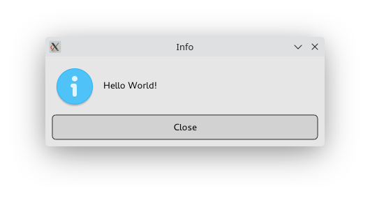
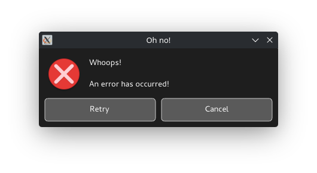
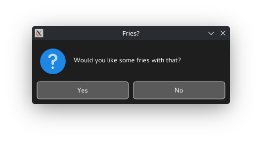

# `alerta`: show GUI dialogs from the command line

`alerta` is a small command-line tool that will display a simple graphical X11 dialog to the user.

It is similar to [Zenity] and [KDialog], but **statically linked** and with
**zero C/C++ dependencies**.

In addition to being a command-line tool, `alerta` can also be used as a Rust library,
for showing simple dialogs from Rust applications that don't want to pull in an entire GUI
framework.

[Zenity]: https://gitlab.gnome.org/GNOME/zenity
[KDialog]: https://github.com/KDE/kdialog

## Goals

- Produce a <1 MB statically linked executable.
- No hard dependencies on `xcb`, `xlib`, or other C libraries.
- Try not to look *completely* out of place in common desktop environments.

## Showcase

```shell
$ alerta "Hello World!"
```



```shell
$ alerta --icon=error --title="Oh no!" --theme=dark --buttons=retrycancel $'Whoops!\n\nAn error has occurred!'
```



```shell
$ alerta --icon=question --title="Fries?" --theme=dark --buttons=yesno "Would you like some fries with that?"
```


